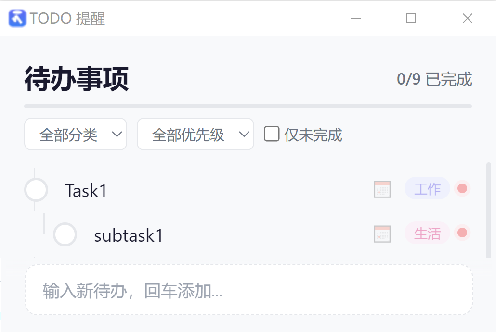

<div align="center">



# TODO 提醒

### 轻量 · 优雅 · 键盘优先的桌面待办管理

基于 [Tauri 2](https://v2.tauri.app/) 构建，支持无限层级任务树、分类标签、优先级管理、
可视化日历、到期系统通知与开机/息屏启动自启——一切只为让你专注于真正重要的事。

<br />

<a href="https://github.com/Lne27/todo-app/releases/latest">
  
</a>

<br />


</div>

<br />

---

## 亮点一览

<table>
<tr>
<td width="50%">

### 🌳 无限层级任务树
像文档一样自由嵌套子任务，`Enter` 创建子项、`Tab` 缩进、`Shift+Tab` 提升，拖拽般流畅的层级管理体验。

</td>
<td width="50%">

### ⌨️ 键盘优先设计
从添加到编辑到删除，全部操作均可通过键盘完成。`↑↓` 导航、`Enter` 创建、`Delete` 移除——双手不离键盘，效率拉满。

</td>
</tr>
<tr>
<td width="50%">

### 🔔 智能到期提醒
设置截止日期后，到期时自动弹出系统通知并置顶窗口。电脑解锁后也会自动检查待办，绝不错过任何截止时间。

</td>
<td width="50%">

### 🎨 分类 & 优先级
5 大预设分类（工作 / 生活 / 学习 / 健康 / 其他）配合 3 档优先级，彩色标签 + 圆点指示器，一眼掌握任务全貌。

</td>
</tr>
</table>

<br />

---

## 应用功能

<details>
<summary><strong>📋 任务管理</strong></summary>

- **层级任务树** — 支持无限嵌套子任务，拖拽缩进即可建立父子关系
- **内联编辑** — 双击任务原地编辑，模糊即自动保存
- **快速添加** — 底部输入框回车即创建，`Ctrl+N` 随时聚焦
- **完成状态** — 点击左侧圆圈切换完成，已完成任务自动划线淡出
- **批量筛选** — 按分类、优先级快速过滤，一键隐藏已完成项
- **进度追踪** — 顶部渐变进度条 + 完成数统计（如 `3/7 已完成`）
- **平滑动画** — 新增 / 删除任务均带流畅过渡效果

</details>

<details>
<summary><strong>📅 日期与提醒</strong></summary>

- **可视化日历** — 点击 📅 图标弹出月历面板，支持上下月导航
- **精确时间** — 时 + 分输入，精确到分钟的截止时间设定
- **智能标签** — 自动识别「今天」「明天」「已过期」并用颜色警示（红 / 黄）
- **系统通知** — 到期时通过系统原生通知弹出提醒（支持 Windows / macOS / Linux）
- **窗口置顶** — 到期时自动将窗口提升到前台，配合 Windows `SetForegroundWindow` 技巧突破焦点限制
- **解锁检测** — Windows 下监听 `WTS_SESSION_UNLOCK` 事件，解锁屏幕后自动弹出过期提醒

</details>

<details>
<summary><strong>🖥️ 系统集成</strong></summary>

- **系统托盘** — 关闭窗口后最小化至托盘，左键单击或右键菜单唤回
- **开机自启** — Windows 下通过注册表 `CurrentVersion\Run` 自动注册开机启动
- **单实例保护** — 通过 Windows Mutex 确保只运行一个实例
- **SQLite 持久化** — 使用 WAL 模式存储在 `%APPDATA%/TodoReminder/todos.db`
- **浏览器回退** — 无 Tauri 环境时自动降级为 `localStorage` 存储

</details>

<br />

---

## 键盘快捷键

| 按键 | 操作 | 按键 | 操作 |
|:---:|:---|:---:|:---|
| `Enter` | 创建子任务 | `↑` `↓` | 在任务间导航 |
| `Tab` | 缩进为上一项的子任务 | `Delete` | 删除当前任务 |
| `Shift + Tab` | 提升到父级 | `Escape` | 退出编辑 / 取消选中 |
| `Backspace` | 空任务时提升层级 / 非空时进入编辑 | `Ctrl + N` | 聚焦快速添加框 |

<br />

---

## 快速开始

### 环境要求

| 依赖 | 版本 |
|:---|:---|
| [Rust](https://rustup.rs/) | stable |
| [Node.js](https://nodejs.org/) | >= 16 |
| [Tauri 构建依赖](https://v2.tauri.app/start/prerequisites/) | 按官方文档配置 |

### 安装与运行

```bash
# 1. 克隆仓库
git clone https://github.com/Lne27/todo-app.git
cd todo-app

# 2. 安装前端依赖
npm install

# 3. 启动开发模式（自动启动 dev-server + Tauri 窗口）
npm run tauri dev

# 4. 构建生产版本（生成安装包）
npm run tauri build
```

构建完成后，安装包位于：

```
src-tauri/target/release/bundle/nsis/TODO提醒_1.0.1_x64-setup.exe
```

### 浏览器预览

无需 Rust 环境，纯前端即可预览（数据存储在 `localStorage`）：

```bash
# 方式一：使用项目内置 dev-server
node dev-server.cjs
# 访问 http://localhost:1420

# 方式二：使用任意静态文件服务器
npx serve src
```

<br />

---

## 项目结构

```
todo-app/
├── src/                          # 前端源码（纯原生 HTML/CSS/JS，零依赖）
│   ├── index.html                # 主页面
│   ├── styles/
│   │   └── main.css              # 全局样式（CSS 变量主题）
│   └── js/
│       ├── app.js                # 主应用：渲染、数据加载、后端通信
│       ├── tree.js               # 层级树数据结构（父子关系、增删改查）
│       ├── interactions.js       # 键盘 / 鼠标交互管理（编辑、导航、缩进）
│       └── dropdown.js           # 分类 / 优先级下拉 & 可视化日历选择器
├── src-tauri/                    # Tauri 后端
│   ├── src/
│   │   ├── main.rs               # 入口：单实例检查 + 启动
│   │   ├── lib.rs                # Tauri Builder 配置与模块注册
│   │   ├── commands.rs           # IPC 命令（增删改查）
│   │   ├── db.rs                 # SQLite 数据库（WAL + CASCADE）
│   │   ├── models.rs             # 数据模型（TodoItem / NewTodo / UpdateTodo）
│   │   ├── tray.rs               # 系统托盘图标与菜单
│   │   ├── reminder.rs           # 到期提醒后台线程 + 窗口置顶
│   │   ├── session.rs            # Windows 解锁事件监听
│   │   └── autostart.rs          # 开机自启注册表操作
│   ├── capabilities/
│   │   └── default.json          # Tauri 权限声明
│   ├── Cargo.toml                # Rust 依赖
│   └── tauri.conf.json           # Tauri 配置
├── dev-server.cjs                # Node.js 静态文件开发服务器
├── package.json
└── README.md
```

<br />

---

## 技术栈

| 层级 | 技术 | 说明 |
|:---|:---|:---|
| **框架** | Tauri 2 | 跨平台桌面应用框架，生成 ~5MB 安装包 |
| **后端** | Rust + rusqlite + chrono | 高性能数据存储，WAL 模式保障并发安全 |
| **前端** | 原生 HTML / CSS / JavaScript | 零第三方依赖，极致轻量 |
| **存储** | SQLite | 本地持久化，支持级联删除 |
| **通知** | tauri-plugin-notification | 原生系统通知 |
| **窗口** | Win32 API | `SetForegroundWindow` / `WTSRegisterSessionNotification` 深度系统集成 |

<br />

---

## 下载

前往 [Releases](https://github.com/Lne27/Todo-App/releases/latest) 页面下载最新版本：

| 平台 | 文件 | 说明 |
|:---|:---|:---|
| Windows x64 | `TODO提醒_1.0.1_x64-setup.exe` | NSIS 安装包，用户级安装，无需管理员权限 |

<br />

---

## License

[MIT](./LICENSE) — 自由使用、修改与分发。

<br />

---

<div align="center">

**如果觉得有用，请给个 ⭐ Star 支持一下！**

</div>
